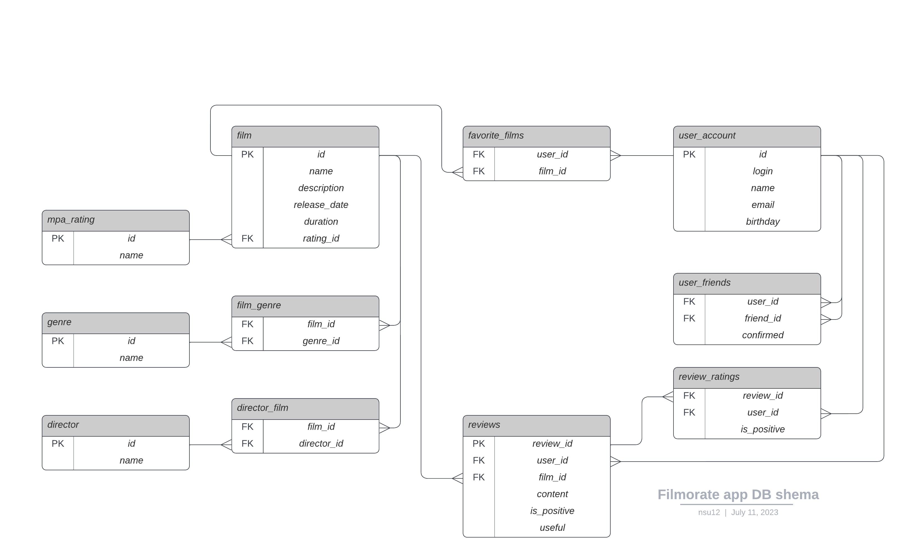

# java-filmorate
The Filmorate project. 

Диаграмма базы данных

Таблица **mpa_rating** содержит список всех возможных рейтингов фильмов согласно стандартам MPA

Таблица **genre** содержит список всех возможных жанров фильмов

Таблица **film**  содержит список фильмов

Таблица **film_genres** предназначена для связи фильмов и жанров, нужна чтобы разорвать связь "многие-ко-многим", так как у одного фильма может быть несколько жанров

Таблица **user_account** содержит список пользователей

Таблица **favorite_films** предназначена для связи лайков пользователей и фильмов. 

Таблица **user_friends** нужна чтобы отобразить дружеские связи пользователей, сделана отдельной таблицей, поскольку у пользователя может быть несколько друзей и дружеские связи могут образовывать циклические графы, например у Ивана друзья Илья и Василий, у Ильи друзья Петр и Семён, у Петра друзья Иван и Елена, и Елена и Семён тоже друзья.  
